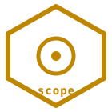

<p align="center">
  
</p>

<h1 align="center">🔭 hexa-scope</h1>

<p align="center"><strong>HEXA-Scope Family</strong> — space telescope substrate · Hubble · JWST · LSST · Roman · post-Hubble (LUVOIR / Origins / HabEx) · n=6 lattice</p>

<p align="center">
  <a href="LICENSE"></a>
  <a href=".github/workflows/lint.yml"></a>
  
  
  
  
  <a href="https://doi.org/10.5281/zenodo.20102618"></a>
  
</p>

<p align="center">Instruments · scopes · space telescopes · JWST · Hubble · LSST · Roman · diffraction · n=6 lattice · hexagonal mirror</p>

---

> Hubble · JWST · LSST · Roman + post-Hubble missions (LUVOIR / Origins / HabEx) under one **n=6 invariant lattice** (σ=12 / τ=4 / φ=2 / J₂=24).
> JWST 18 hexagonal mirror segments = n=6 invariant **direct hardware instance**.

## Why

망원경 substrate는 cosmology(이론)와 space-operations(운영) 사이의 **specialized bridge**:
- 거울 기하 (segment count · symmetry order · diffraction limit)
- 분광 대역 (UV / Optical / IR / mm-wave)
- mission lifecycle (commission → survey → archive)

JWST의 18-segment hexagonal primary mirror가 가장 단적인 n=6 instance — `18 = 3 · σ(6)/2`. 본 substrate는 이 하드웨어 사실을 출발점으로 7-mission post-Hubble 시대를 closed-form lattice 안에서 정리한다.

## Status

**spec-first** (작동 .hexa CLI TBD). 2-verb cp -R 시드 + 7-mission overview docs.
JWST 18-hexagonal mirror = n=6 invariant **direct hardware instance** — 본 substrate가 정당화하는 가장 강한 falsifier 후보.

## Install

```bash
# 1. Install hexa-lang (ships `hexa` + `hx` package manager)
/bin/bash -c "$(curl -fsSL https://raw.githubusercontent.com/dancinlab/hexa-lang/main/install.sh)"

# 2. Install hexa-scope
hx install hexa-scope          # global, pulls latest from registry
```

## Run

```bash
hexa-scope observatory               # cosmic-observatory spec (md seed)
hexa-scope obs_astronomy             # observational-astronomy spec (md seed)
hexa-scope mission hubble            # HST · 1990 · 2.4 m monolith
hexa-scope mission jwst              # JWST · 2021 · 6.5 m · 18 hex segments (n=6!)
hexa-scope mission lsst              # Vera Rubin / LSST · 2025 · 8.4 m TMA
hexa-scope mission roman             # Roman · 2027 · 2.4 m wide-field IR + CGI
hexa-scope mission luvoir            # LUVOIR proposal → HWO (UV/O/IR)
hexa-scope mission origins           # Origins proposal (far-IR)
hexa-scope mission habex             # HabEx proposal → HWO (coronagraph/starshade)
hexa-scope status                    # print substrate status table
hexa-scope selftest                  # sentinel sweep
hexa-scope help                      # full --help
```

## Verify

`hexa-scope`는 spec-first 4-script closure 패턴을 따른다 (sister of hexa-matter / hexa-space / hexa-cosmos):

```bash
hexa run verify/run_all.hexa      # aggregate sweep — 4/4 scripts must PASS
```

| Script | Anchor | Source |
|---|---|---|
| `verify/spec_presence.hexa` | 2 verbs + 7 mission docs present on disk | LATTICE_POLICY §1.3 rule 1 |
| `verify/lattice_arithmetic.hexa` | σ·φ = n·τ = J₂ = 24 (aux only — never sole) | LATTICE_POLICY §1.3 rule 1 |
| `verify/real_limits_anchor.hexa` | Diffraction λ/D · Photon √N · NA ≤ n · c-bound · CMB | LIMIT_BREAKTHROUGH Wave M |
| `verify/closure_consistency.hexa` | CLI · toml · README · AGENTS scoreboard agree | LATTICE_POLICY §1.3 rule 4 |


**Future missions** (LUVOIR-A 15 m / LUVOIR-B 8 m / Origins 5.9 m / HabEx 4 m) remain **CONCEPT · funding-pending** per NASA Astro2020 decadal study — they have **not** flown. Markers preserved in `docs/missions/{luvoir,origins,habex}.md` and in the audit.

## Repo layout

```
hexa-scope/
├── README.md
├── LICENSE                       MIT
├── CHANGELOG.md
├── RELEASE_NOTES_v1.0.0.md
├── CITATION.cff
├── hexa.toml                     project manifest
├── install.hexa                  hx install hook
├── cli/
│   └── hexa-scope.hexa           CLI dispatcher (observatory · obs_astronomy · mission · status · selftest)
├── observatory/                  T1 SPEC — cosmic-observatory seed (md)
├── obs_astronomy/                T1 SPEC — observational-astronomy seed (md)
├── docs/
│   ├── logo.svg                  hexagon + scope glyph
│   └── missions/                 7 mission overview docs (hubble · jwst · lsst · roman · luvoir · origins · habex)
├── verify/                       4 closure scripts (spec_presence · lattice_arithmetic · real_limits · closure_consistency)
├── tests/                        hexa native test runner
├── selftest/                     sentinel sweep
├── examples/                     usage samples
├── LATTICE_POLICY.md             n=6 aux-only check policy
├── LIMIT_BREAKTHROUGH.md         Wave M (diffraction · photon √N · NA bound · CMB) anchors
└── AGENTS.tape                   agent identity + repo layout (governance #4)
```

## Cross-link

| Sister substrate | 역할 |
|---|---|
| 🌌 [dancinlab/hexa-cosmos](https://github.com/dancinlab/hexa-cosmos) | 이론 cosmology cousin (cosmology + particle + cosmic-observatory) |
| 🚀 [dancinlab/hexa-space](https://github.com/dancinlab/hexa-space) | 관측 운영 cousin (aerospace + astronomy 11-verb) |
| 🧊 [dancinlab/hexa-rtsc](https://github.com/dancinlab/hexa-rtsc) | cryogenic optics 의존 (JWST MIRI -266°C) |

## License

MIT — Copyright (c) 2026 dancinlab (박민우 <nerve011235@gmail.com>)

Provenance: extracted from [canon@c0f1f570](https://github.com/dancinlab/canon) on 2026-05-06.
